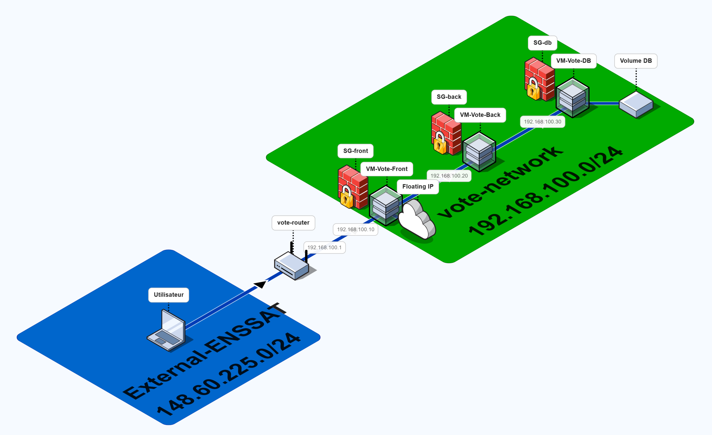

# Démos - Système de vote électronique

Ce projet est une démonstration d'un système de vote électronique développé dans le cadre d'un projet universitaire. Il permet aux électeurs de se connecter et de participer à des élections en ligne, de manière sécurisée et anonyme. Un panneau d'administration permet de gérer les élections, les candidats et les électeurs.

Ce projet est une application web suivant une architecture client-serveur, avec une base de données pour stocker les informations relatives aux élections et aux utilisateurs.

Compte de tests :
- Electeur : 123456789 / test1234
- Admin : hSimpsons@gouv.fra / admin1234 (http://<Adresse_IP>/admin/login)

## Principales technologies utilisées

| Technologie        | Rôle                             |
|--------------------|----------------------------------|
| React              | Frontend                         |
| NestJS             | Backend                          |
| Prisma             | ORM                              |
| PostgreSQL         | Base de données                  |
| Docker             | Conteneurisation                 |

## Utilisation

Parcours typique pour un électeur :
1. Sur la page d'accueil, se connecter avec son identifiant et son mot de passe (Compte de test : 123456789 / test1234)
2. Un OTP sera demandé pour valider la connexion (le code OTP est affiché dans la console du navigateur pour cette démo)
3. Une fois connecté, choisir le candidat pour lequel voter
4. Confirmer le vote
5. Consulter les résultats en temps réel (web sockets) sur la page dédiée

Pour un administrateur, il n'y a pas de parcours spécifique mais il est possible de gérer les élections, les candidats et les électeurs via le panneau d'administration.

## Installation locale

Pour lancer le projet en local :

1. Créer un ```.env``` en se basant sur le ```.env.example```
2. Éxécuter la commande ```docker compose up -d```
3. Ouvrir et navigateur et se connecter à http://localhost:8081/


## Déploiement sur OpenStack



Ce schéma se veut volontairement simplifié et omet certains détails de configuration comme les règles des Security Groups (ports et restrictions par IP), qui sont gérés via le template Heat.

L'environnement de production sur OpenStack est composé de trois machines virtuelles (VM) :
- **VM Frontend** : héberge l'application React et le reverse proxy NGINX
- **VM Backend** : héberge l'API NestJS
- **VM Base de données** : héberge PostgreSQL

| VM | IP interne |
|----|------------|
| VM Frontend | 192.168.100.10 |
| VM Backend | 192.168.100.20 |
| VM Base de données | 192.168.100.30 |

L’architecture repose sur trois machines virtuelles distinctes (frontend, backend et base de données) afin de séparer clairement les responsabilités applicatives, limiter la surface d’exposition réseau

Chaque composant est déployé en instance unique, sans mécanisme de haute disponibilité ni de répartition de charge, afin de privilégier la lisibilité de l’architecture et la reproductibilité du déploiement plutôt qu’une approche orientée production.

Par manque de temps, l’orchestration des conteneurs n’a pas été réalisée via Docker Swarm ou Kubernetes. La mise en place d’un tel cluster aurait nécessité l’initialisation d’un nœud manager, la récupération et la gestion des join tokens, l’enrôlement de nœuds workers supplémentaires, ainsi qu’un déploiement applicatif via des services répliqués. Le choix s’est donc porté sur Docker Compose, plus adapté à un déploiement rapide et lisible dans le cadre du projet.

### Gestion du build des conteneurs

Le build des services frontend et backend repose sur des Dockerfiles multi-stages, permettant de produire des images légères et reproductibles. La phase de build (installation des dépendances, génération Prisma, compilation TypeScript) est séparée de l’image finale d’exécution.

Les fichiers docker-compose-prod.yaml sont volontairement limités à l’assemblage des services (variables d’environnement, ports, volumes et redémarrage), afin d’éviter d’y concentrer de la logique applicative. Ce choix permet une meilleure maintenabilité et s’inscrit dans une approche proche des bonnes pratiques industrielles.


### Étapes de déploiement

Le déploiement est automatisé via un template Heat, qui gère :
- l’infrastructure réseau (réseau privé, sous-réseau, routage),
- les machines virtuelles et leurs adresses IP internes,
- les groupes de sécurité,
- un volume persistant pour la base de données,
ainsi que le déploiement applicatif via Docker.

Une fois la stack créée, l’application est immédiatement accessible via la Floating IP associée à la VM Frontend.

### Déploiement en CLI ou via Horizon

Le template Heat `stack-vote.yaml` peut être déployé via la CLI OpenStack ou l’interface Horizon (Orchestration > Stacks > Create Stack).

```bash
openstack stack create -t stack-vote.yaml -e stack-vote-env.yaml IAI3_04_Systeme_Vote
```

### Accès à l'application

Une fois le stack déployé, l'URL d'accès à l'application sera affichée dans les outputs de la stack (ex : `http://<Floating_IP>`).

### Structure du projet

- `front/` : application React (client)
- `server/` : API NestJS (backend)
- `db/` : configuration Docker Compose pour PostgreSQL

### Notes de sécurité

Les accès aux ports sont restreints par des groupes de sécurité :
- Seul le frontend est exposé à Internet (port 80), le port 443 est ouvert mais HTTPS n'est pas configuré
- Le backend et la base de données ne sont accessibles que depuis les VMs internes
- SSH est ouvert depuis Internet sur la VM Frontend (point d'entrée), les autres VMs ne sont accessibles que par rebond

### Améliorations possibles

Dans le cadre de ce projet de démonstration, l’architecture a été volontairement simplifiée afin de privilégier la lisibilité et l’automatisation du déploiement. Des aspects tels que la haute disponibilité, la scalabilité horizontale ou la gestion avancée des secrets n’ont pas été implémentés, mais pourraient constituer des axes d’amélioration dans un contexte de production réel.
Une extension possible consisterait à déployer le frontend et le backend sous forme de services Docker Swarm répliqués sur plusieurs VMs, avec un nœud manager et des workers, afin d’améliorer la tolérance aux pannes. Une mise en production réelle nécessiterait également l’ajout d’un chiffrement TLS et d’un mécanisme de gestion centralisée des secrets.